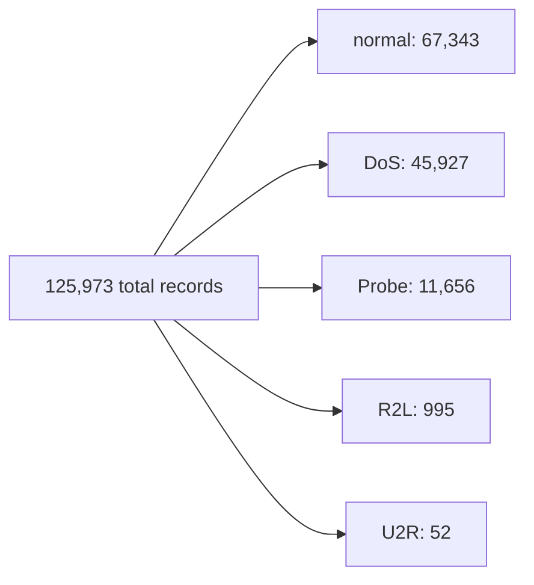
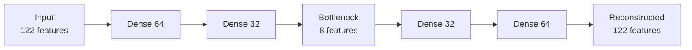

[README.md](https://github.com/user-attachments/files/32458545/README.md)
# Network Intrusion Detection System Using Machine Learning & Deep Learning

A hands-on machine learning project that detects and classifies network attacks using the NSL-KDD dataset. This project explores both classical machine learning and deep learning approaches, and documents the reasoning behind each decision, not just the final result.

## Table of Contents

- [Why This Project Matters](#why-this-project-matters)
- [The Dataset](#the-dataset)
- [Project Journey](#project-journey)
- [Key Results](#key-results)
- [Tech Stack](#tech-stack)
- [How to Run](#how-to-run)
- [What's Next](#whats-next)
- [A Note on AI Assistance](#a-note-on-ai-assistance)

## Why This Project Matters

Every device connected to a network — a laptop, a server, a smart camera — generates traffic. Most of that traffic is harmless. Some of it isn't. A Network Intrusion Detection System (NIDS) is software that watches this traffic and tries to answer one question in real time: **is this normal, or is someone trying to do something malicious?**

This project builds and compares several approaches to answering that question, using a well-known benchmark dataset from the cybersecurity research community.

## The Dataset

This project uses **NSL-KDD**, an improved version of the original KDD Cup 1999 dataset, which itself came from network traffic captured during a DARPA cybersecurity research program. The original dataset had a known problem: it contained a huge number of duplicate records, which caused machine learning models to look more accurate than they really were. NSL-KDD fixed this by removing duplicates and rebalancing the data, and it remains one of the most widely cited datasets for intrusion detection research.

Each record represents a single network connection, described by 41 features grouped into four categories:

| Feature Group | What It Captures | Example Features |
|---|---|---|
| Basic | Properties of the connection itself | duration, protocol type, bytes sent |
| Content | What happened *inside* the connection | failed logins, root access attempts |
| Time-based traffic | Activity in the last 2 seconds | connections to the same host/service |
| Host-based traffic | Activity over a longer window | connections to the same host over ~100 connections |

Every record is labeled as either `normal` or one of ~22 specific attack types, which this project groups into four standard attack categories:

- **DoS** (Denial of Service) — flooding a system to make it unavailable
- **Probe** — scanning a system to find weaknesses before attacking
- **R2L** (Remote to Local) — trying to gain unauthorized local access from outside
- **U2R** (User to Root) — escalating from limited access to full admin control

**An important design detail:** the test set deliberately includes attack subtypes that never appear in the training set. This simulates a real-world challenge — new attacks are invented constantly, and a good detection system needs to generalize, not memorize.

## Project Journey

### 1. Exploratory Data Analysis

Before building anything, the data was explored to understand its structure. Two findings shaped everything that followed:

**The data is heavily imbalanced.**

With only 52 examples of U2R attacks, any model was going to struggle to learn what one looks like.

**Network features carry strong signal.** Cross-tabulating the `flag` feature (how a connection ended) against attack category showed that 99% of connections with an `S0` flag (connection attempt with no reply) were DoS attacks — a near-perfect indicator hiding in plain sight.

### 2. Classical Machine Learning

A baseline **Random Forest** classifier was trained first. It performed well on the common classes (`normal`, `DoS`) but almost completely failed to detect `R2L` and `U2R` — recall near 0% for both. This was expected given how few training examples existed for these classes.

Two strategies were tested to address this:

- **SMOTE** (Synthetic Minority Over-sampling Technique) — generates synthetic examples of minority classes by interpolating between real ones, rather than simply duplicating them
- **XGBoost** — a gradient-boosted tree algorithm where each new tree specifically corrects the mistakes of the previous ones, generally stronger than Random Forest on complex tabular data

Combining XGBoost with a custom SMOTE ratio (rather than fully balancing all classes) gave the best classical result, but a hard ceiling remained: **R2L recall never exceeded 9%**, no matter which classical technique was applied. This strongly suggested the limitation was in the *nature of the task*, not the choice of algorithm — a large share of R2L/U2R attacks in the test set are subtypes the model had genuinely never seen.

### 3. A Different Angle: Anomaly Detection

Rather than continuing to ask *"which of these five categories is this?"*, the project pivoted to a simpler and more powerful question: **"does this look like normal behavior at all?"**

This was implemented with an **autoencoder** — a neural network trained only on `normal` traffic, whose job is to compress each record down to a small representation and then reconstruct it. Because it only ever saw normal behavior during training, it reconstructs normal traffic well and struggles with anything else — including attack types it has never seen before. That reconstruction error becomes the detection signal.

This reframing removed the core problem entirely: the model no longer needs many examples of each rare attack type, only a strong sense of what "normal" looks like — and normal traffic is abundant.

## Key Results

| Approach | Overall Accuracy | Recall: R2L | Recall: U2R |
|---|---|---|---|
| Random Forest (baseline) | 75% | 0% | 1% |
| Random Forest + SMOTE (custom ratio) | 75% | 7% | 21% |
| XGBoost + SMOTE | 78% | 9% | 21% |
| **Autoencoder (anomaly detection)** | **87%** | **60%** | **78%** |

Reframing the problem from *classification* to *anomaly detection* improved detection of the hardest, rarest attack types by 6–8x, without needing more data — just a better question.

## Tech Stack

- **Python** — core language
- **Pandas / NumPy** — data manipulation and analysis
- **Matplotlib / Seaborn** — visualization
- **Scikit-learn** — preprocessing, Random Forest, evaluation metrics
- **imbalanced-learn** — SMOTE implementation
- **XGBoost** — gradient boosting classifier
- **TensorFlow / Keras** — autoencoder (deep learning)

## How to Run

1. Open a new notebook on [Kaggle](https://www.kaggle.com)
2. Add the NSL-KDD dataset (search "NSL-KDD" under the Datasets tab and add it as input)
3. Upload/copy the notebook from this repository
4. Run the cells in order — each section is commented to explain what it does and why

## What's Next

The current version treats anomaly detection and attack classification as separate experiments. The next step is combining them into a two-stage pipeline:

1. **Stage 1 (Autoencoder):** Is this traffic normal or suspicious?
2. **Stage 2 (XGBoost):** If suspicious, which specific attack type is it?

This mirrors how real intrusion detection systems are often designed in practice — a fast, general anomaly filter followed by a more detailed classifier for anything flagged.

## A Note on AI Assistance

Parts of this project — explanations, debugging help, and code review — were developed with the assistance of AI tools. The analysis, experimentation, decisions, and interpretation of results are my own work as part of learning this field hands-on.
